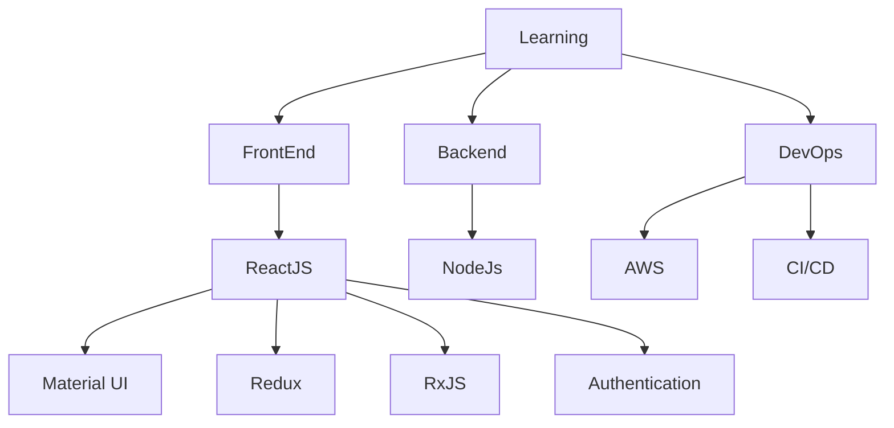

# Learning Plan

```mermaid
  graph TD;
      A[Learning]-->F[FrontEnd]-->react[ReactJS];
      A-->B[Backend]-->node[NodeJs];
      A-->DevOps-->AWS
      
      DevOps-->CI/CD
      react-->MUI[Material UI]
      react-->Redux
      react-->RxJS
      react-->auth[Authentication]
```
