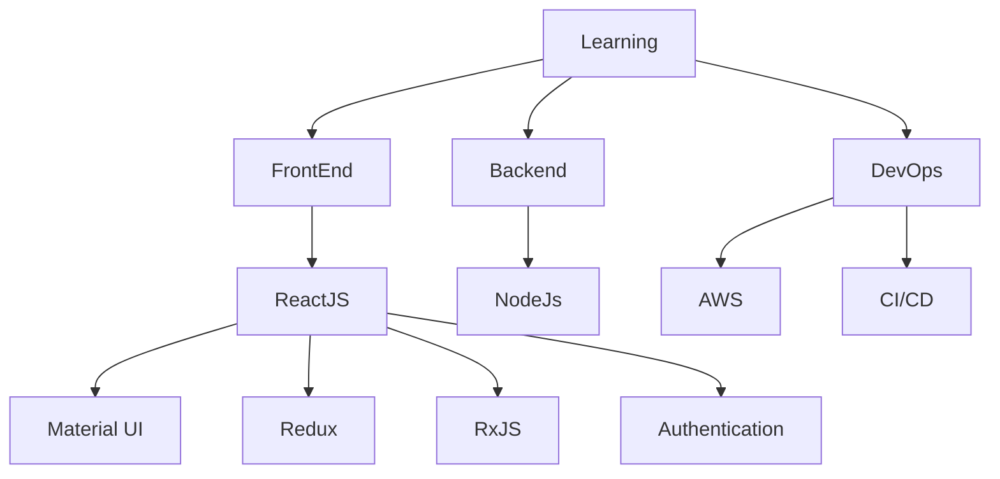
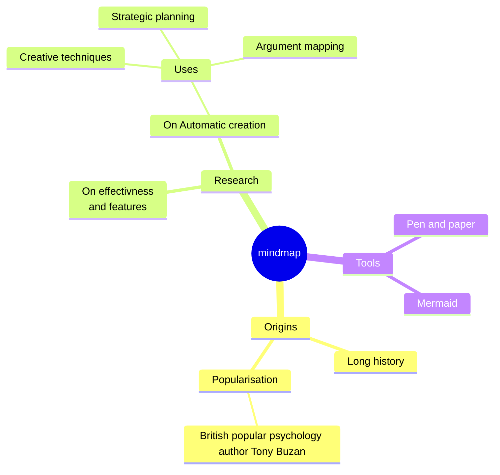

# Learning Plan

```mermaid
  graph TD;
      A[Learning]-->F[FrontEnd]-->react[ReactJS];
      A-->B[Backend]-->node[NodeJs];
      A-->DevOps-->AWS
      
      DevOps-->CI/CD
      react-->MUI[Material UI]
      react-->Redux
      react-->RxJS
      react-->auth[Authentication]
```

```mermaid
mindmap
  root((mindmap))
    Origins
      Long history
      ::icon(fa fa-book)
      Popularisation
        British popular psychology author Tony Buzan
    Research
      On effectivness<br/>and features
      On Automatic creation
        Uses
            Creative techniques
            Strategic planning
            Argument mapping
    Tools
      Pen and paper
      Mermaid
```
